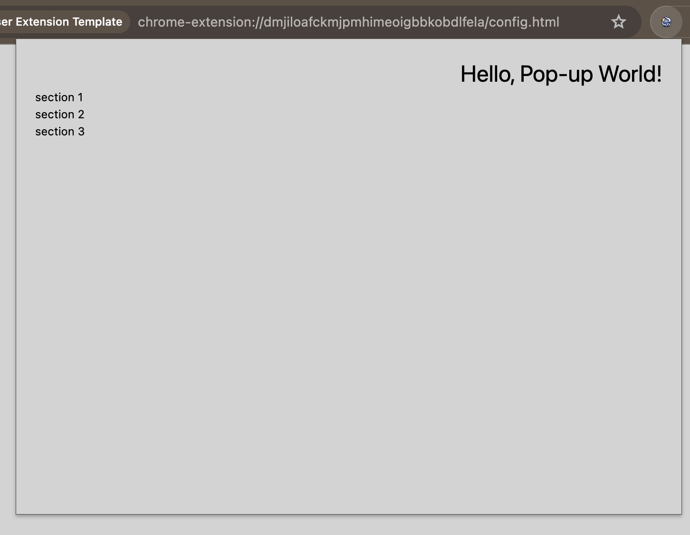

# Multi-Browser Extension Template

   

This is a template for creating multi-browser extensions. It provides a starting point for developing browser extensions that can be used across different browsers such as Chrome and Firefox.

## Features

- Cross-browser compatibility
- Easy setup and configuration
- Modular architecture
- Support for common extension functionalities
- Includes a popup and options page example
- Linting with ESLint

## Package structure

- `src` : contains the source code for the extension broken out into modules
  - `popup` : contains the code for the popup page
    
  - `config` : contains the code for the options page
    
  - `manifest.json` : contains the manifest for the extension
- `dist` : contains the built extension
- `export` : contains the packaged extension
- `.readme` : contains images for the readme
- `.github` : contains GitHub Actions workflows (This folder can be deleted if yo do not intend to use GitHub Actions)
  - `workflows` : contains the workflows for the repository
  - `CODEOWNERS` : contains the code owners for the repository
  - `dependabot.yml` : contains the configuration for Dependabot

## Currently Missing Features

- [ ] Background script
- [ ] [jest](https://jestjs.io/)
- [ ] [Prettier](https://prettier.io/)

## Stack

- [TypeScript](https://www.typescriptlang.org/)
- [Webpack](https://webpack.js.org/)
- [React](https://reactjs.org/)
- [Sass](https://sass-lang.com/)
- [SWC](https://swc.rs/)

## Getting Started

To get started with this template, follow these steps:

1. Clone the repository: `git clone https://github.com/xn4p4lm-org/multi-browser-extension-template.git`
2. Install the dependencies: `yarn install`
3. Customize the extension according to your needs
4. Build the extension: `yarn dev`
5. Load the extension in your browser using the `dist` directory
   - For Chrome: Open `chrome://extensions/` and enable Developer mode. Click on "Load unpacked" and select the `dist` directory.
   - For Firefox: Open `about:debugging` and click on "This Firefox". Click on "Load Temporary Add-on" and select the `dist/manifest.json` file.

## Building the Extension

To build the extension, you just need to run `yarn package`. This will create a zip file in the `export` directory that can be uploaded to the Chrome Web Store or Mozilla Add-ons.

## Linting

To lint the code, run `yarn lint`. This will run ESLint on the `src` directory with debug mode and show any errors or warnings.

## Contributing

Contributions are welcome! If you have any ideas, suggestions, or bug reports, please open an issue or submit a pull request.

## License

This project is licensed under the [MIT License](LICENSE).

## Copyright

© 2024 [Diana (@xN4P4LM)](https://github.com/xN4P4LM) et al.
